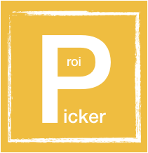
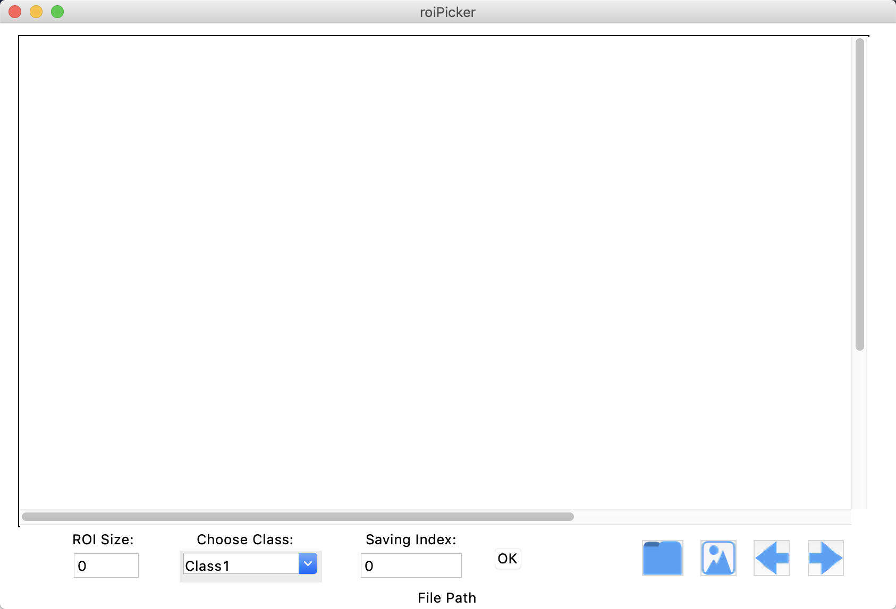
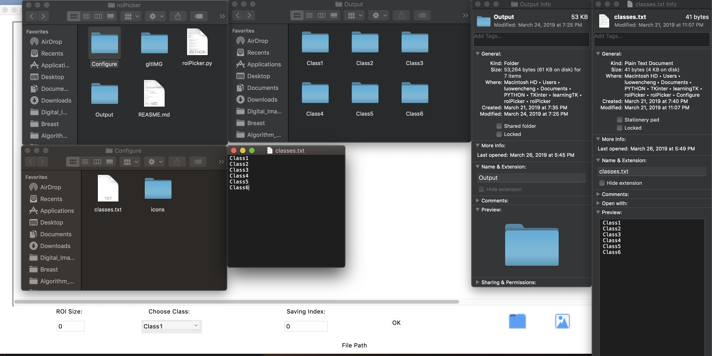
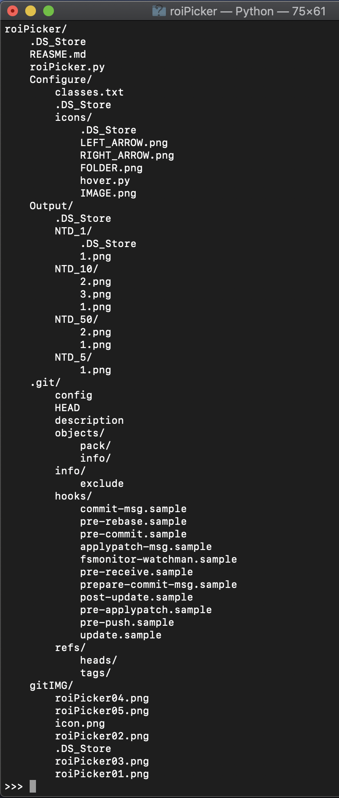
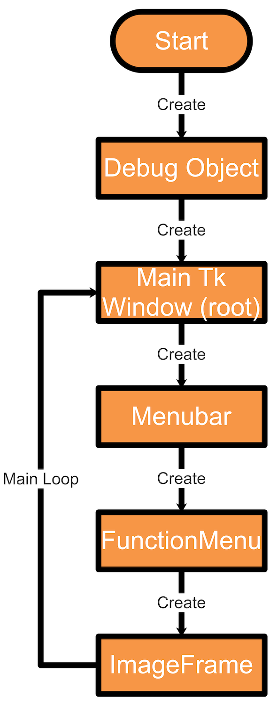

<h1 align="center">
  <br/>roiPicker
</h1>

<h4 align="center">
  Specific Rectangle Image Cropping and Saving with Python
</h4>  

<br/>

<div align="center">
  
</div>

## Description

**roiPicker** is a specific rectangle image cropping tool. 
It is written in Python and uses tkintter for its graphical interface.  

<h4 align="center">
  
</h4>  


## Features

- [Ｏ] Image cropping and saving for rectangle.  
- [Ｏ] GUI customization (predefined labels / class).  

## Hotkey
|        Hotkey (快捷鍵)      |           Function Explanations (功能說明)         |
| :------------------------: | :------------------------------------------------ |
|             z              | Next image (下一張圖片)                            |
|             a              | Previous image (上一張圖片)                        |
|             x              | Add rectangle size (增加正方框的尺寸)               |
|             s              | Minus rectangle size (減少正方框的尺寸)             |
| Double-ButtonPress (Mouse) | Saving rectangle box region (儲存正方框裡的區域影像) |


## Requirements

- Ubuntu / macOS / Windows
- Python3


## Package Installation (pip/pip3 install)

Please check dependency of Python3, and using pip / pip3 to install python3 packages:  

```bash
# pip/pip3 install packages of python3
# cv2
pip install opencv-python
# PIL
pip install Pillow==2.2.1
```  

Cloning a Git repository:  

```bash
git clone https://github.com/WoodyLuo/roiPicker.git
```  


## Remark

Please remember that you must have a _Configure_ folder and a _Output_ folder under the **roiPicker.py**.    

>In **_configure_ folder**:  
>There must be a _classes.txt_ text file. **We can set the category of the drop-down menu of our User Interface, UI by using the _classes.txt_ file**.  
  
>In **Output資料夾**:  
>We will need to create a folder which is a saving folder of region of interest, ROI image. And **the file name must match the name of the catefory specified by _classes.txt_ file**.  
  

<h4 align="center">
 
</h4>  


<h5 align="center">
  Specific Rectangle Image Cropping with Python
</h5>  


## Object Chart

<h4 align="center">

</h4>  


<h5 align="center">
  The Object Chart of roiPicker.py
</h5> 


## Other Tools  

<h5 align="left">
  A graphical image annotation tool
</h5>  

- **[Labelme](https://github.com/wkentaro/labelme)**:
Image annotation for polygon, rectangle, circle, line and point.
(Supports: Mask RCNN, YOLO, faster RCNN )  
- **[LabelImg](https://github.com/tzutalin/labelImg)**:
Image annotation for rectangle.
(Supports: YOLO, faster RCNN )  


## Support
Please report any questions and suggestions to [Woody Lo](mailto:ability1013@gmail.com).  

